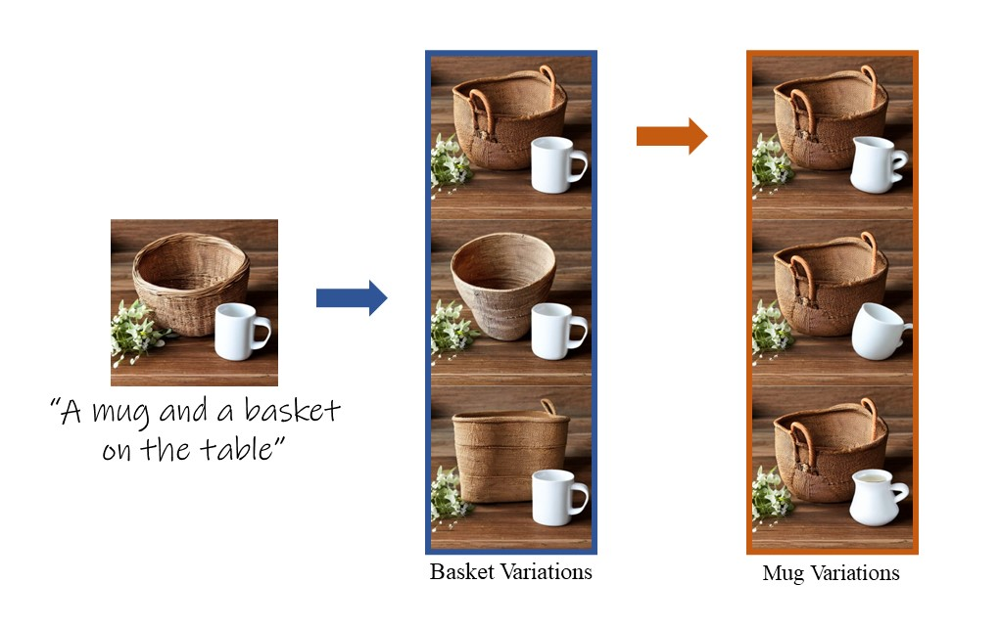
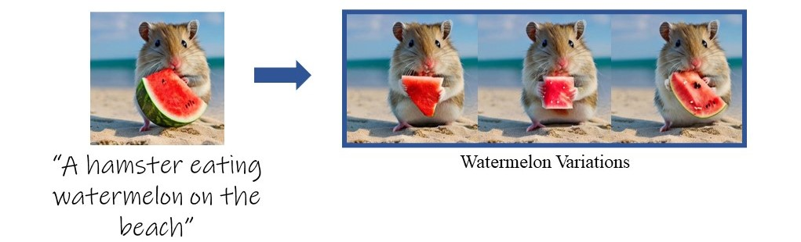
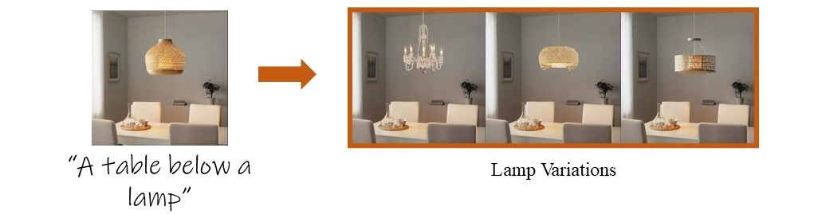

# Localizing Object-level Shape Variations with Text-to-Image Diffusion Models (ICCV 2023)

> **Or Patashnik, Daniel Garibi, Idan Azuri, Hadar Averbuch-Elor, Daniel Cohen-Or**
> 
> Text-to-image models give rise to workflows which often begin with an exploration step, where users sift through a large collection of generated images. The global nature of the text-to-image generation process prevents users from narrowing their exploration to a particular object in the image. In this paper, we present a technique to generate a collection of images that depicts variations in the shape of a specific object, enabling an object-level shape exploration process. Creating plausible variations is challenging as it requires control over the shape of the generated object while respecting its semantics. A particular challenge when generating object variations is accurately localizing the manipulation applied over the object's shape. We introduce a prompt-mixing technique that switches between prompts along the denoising process to attain a variety of shape choices. To localize the image-space operation, we present two techniques that use the self-attention layers in conjunction with the cross-attention layers. Moreover, we show that these localization techniques are general and effective beyond the scope of generating object variations. Extensive results and comparisons demonstrate the effectiveness of our method in generating object variations, and the competence of our localization techniques.


<a href="https://orpatashnik.github.io/local-prompt-mixing/"></a> 
<a href="https://arxiv.org/abs/2303.11306"></a>
[](https://huggingface.co/spaces/orpatashnik/local-prompt-mixing)

<p align="center">

</p>

## Description  
Official implementation of our Localizing Object-level Shape Variations with Text-to-Image Diffusion Models paper.

## Setup

### Environment
Our code builds on the requirement of the official [Stable Diffusion repository](https://github.com/CompVis/stable-diffusion). To set up the environment, please run:

```
conda env create -f lpm_env.yml
conda activate lpm
```

Then, please run in python:
```python
import nltk
nltk.download('punkt')
nltk.download('averaged_perceptron_tagger')
```

This project has a gradio [demo](https://huggingface.co/spaces/orpatashnik/local-prompt-mixing) deployed in HuggingFace.
To run the demo locally, run the following: 
```shell
gradio gradio_app.py
```
Then, you can connect to the local demo by browsing to `http://localhost:7860/`.

## Prompt Mix & Match Usage

### Generated Images

<p align="center">
  
<br>
Example generations by Stable Diffusion with variations outputted by Prompt Mix & Match. 
</p>


To generate an image, you can simply run the `main.py` script. For example,
```
python main.py --seed 48 --prompt "hamster eating {word} on the beach" --object_of_interest "watermelon" --background_nouns=["beach","hamster"]
```
Notes:

- To choose the amount of required variations, specify: `--number_of_variations 20`.
- You may use your own proxy words instead of the auto-generated words. For example `--proxy_words=["pizza","ball","cube"]`.
- In order to change the shape inerval ($T_3$ and $T_2$ in the paper), specify: `--start_prompt_range 5 --end_prompt_range 15`.
- You may use self-attention localization, for example `--objects_to_preserve=["hamster"]`.
  - You may also remove the object of interest from the self attention mask by specifing `--remove_obj_from_self_mask True` (this flag is `True` by default)

All generated images will be saved to the path `"{exp_dir}/{prompt}/seed={seed}_{exp_name}/"`:
```
{exp_dir}/
|-- {prompt}/
|   |-- seed={seed}_{exp_name}/
|       |-- {object_of_interest}.jpg 
|       |-- {proxy_words[0]}.jpg
|       |-- {proxy_words[1]}.jpg
|       |-- ...
|       |-- grid.jpg
|       |-- opt.json
|   |-- seed={seed}_{exp_name}/
|       |-- {object_of_interest}.jpg 
|       |-- {proxy_words[0]}.jpg
|       |-- {proxy_words[1]}.jpg
|       |-- ...
|       |-- grid.jpg
|       |-- opt.json
...
```
The default values are `--exp_dir "results" --exp_name ""`.
### Real Images

<p align="center">
  
<br>
Example real image with variations outputted by Prompt Mix & Match. 
</p>

To generate an image, you can simply run the `main.py` script. For example,
```
python main.py --real_image_path "real_images/lamp_simple.png" --prompt "A table below a {word}" --object_of_interest "lamp" --objects_to_preserve=["table"] --background_nouns=["table"]
```

All generated images will be saved in the same format as for generated image.

## Self-Segmentation

<p align="center">
  
<br>
Example segmantation of a real image. 
</p>

To get segmentation of an image, you can simply run the `run_segmentation.py` script.
The paraments of the segmentation located inside the script at the `SegmentationConfig` class:
- To use a real image, specify its path at the attribute `real_image_path`.
- You may change the number of segments with the `num_segments` param.

The outputs will be saved to the path `"{exp_path}/"`:
```
{exp_path}/
|   |-- real_image.jpg
|   |-- image_enc.jpg
|   |-- image_rec.jpg
|   |-- segmentation.jpg
```
- `real_image.jpg` - Original image.
- `image_enc.jpg` - Reconstration of the image by stable autoencoder only.
- `image_rec.jpg` - Reconstration of the image by stable diffusion full pipeline.
- `segmentation.jpg` - Segmentation output.


## Acknowledgements 
This code is builds on the code from the [diffusers](https://github.com/huggingface/diffusers) library as well as the [Prompt-to-Prompt](https://github.com/google/prompt-to-prompt/) codebase.

## Citation

If you use this code for your research, please cite our paper:

```
@InProceedings{patashnik2023localizing,
    author    = {Patashnik, Or and Garibi, Daniel and Azuri, Idan and Averbuch-Elor, Hadar and Cohen-Or, Daniel},
    title     = {Localizing Object-level Shape Variations with Text-to-Image Diffusion Models},
    booktitle = {Proceedings of the IEEE/CVF International Conference on Computer Vision (ICCV)},
    year      = {2023}
}
```
